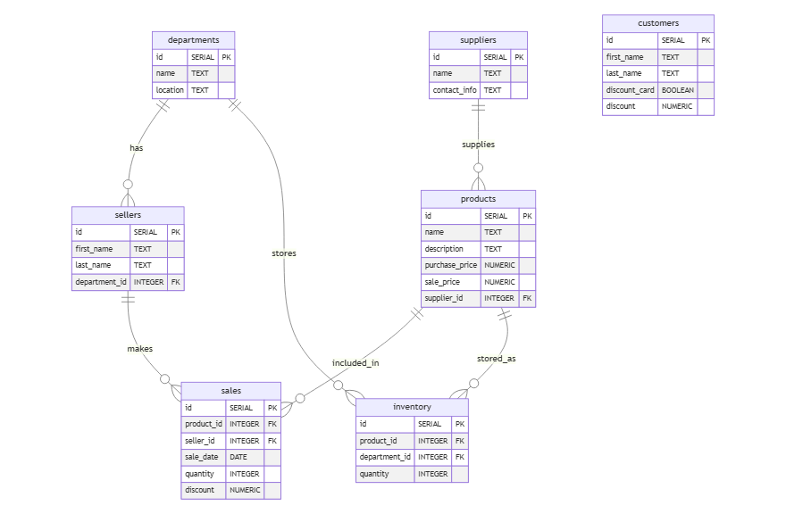
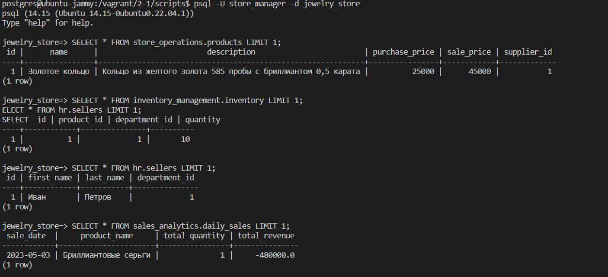
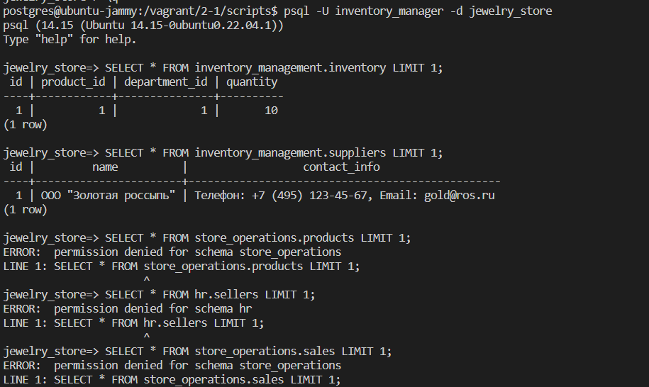
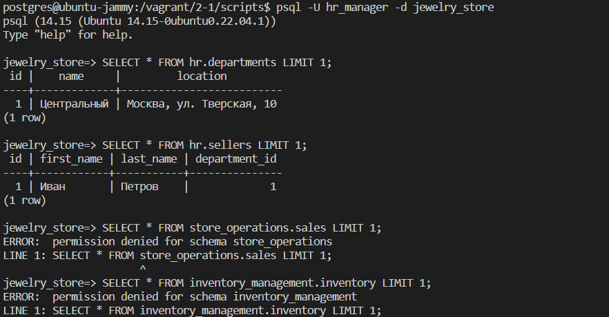
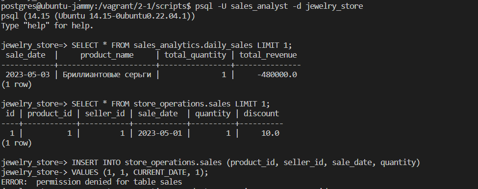
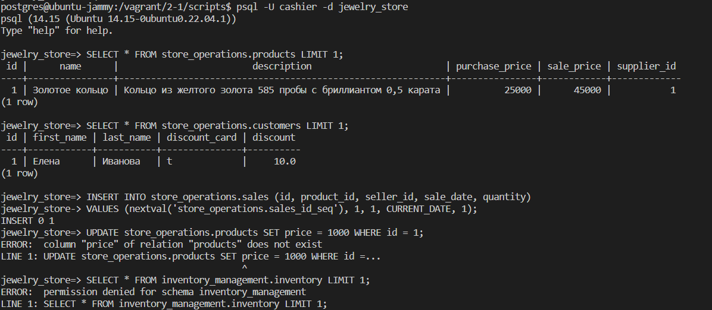
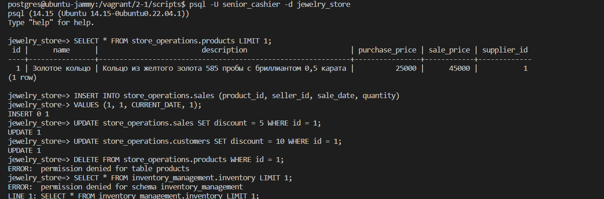

# НИЯУ МИФИ. Лабораторная работа №2-1

## Журбенко Василий, Б21-525. 2024

## Диаграмма


## Ход работы

### 1. Определение схемы и необходимость её изменения

Изначально все таблицы находились в схеме public (схема по умолчанию в PostgreSQL). Анализ показал необходимость разделения на несколько схем для лучшей организации данных ювелирного магазина.

Созданные схемы:

```sql

CREATE SCHEMA store_operations;    -- Для основных операций магазина

CREATE SCHEMA inventory_management; -- Для управления запасами

CREATE SCHEMA hr;                  -- Для управления персоналом

CREATE SCHEMA sales_analytics;     -- Для аналитики продаж

```

Причины разделения на схемы:

1. Логическое разделение функционала

2. Улучшение безопасности и контроля доступа

3. Упрощение администрирования

4. Улучшение организации и поддержки кода

### 2. Определение необходимых ролей и привилегий
Основные роли:

1. store_manager (Менеджер магазина)
- Системные привилегии: USAGE на все схемы
- Объектные привилегии: ALL на все таблицы
- Полный доступ ко всем данным

2. inventory_manager (Менеджер по запасам)
- Схема: inventory_management
- Привилегии: ALL на таблицы inventory и suppliers
- SELECT на products

3. hr_manager (HR-менеджер)
- Схема: hr
- Привилегии: ALL на таблицы departments и sellers

4. sales_analyst (Аналитик продаж)
- Схема: sales_analytics, store_operations
- Привилегии: SELECT на все таблицы для анализа

5. cashier (Кассир)
- Схема: store_operations
- Привилегии: 
  - SELECT, INSERT на sales
  - SELECT на products и customers

Вложенная роль:
- senior_cashier (Старший кассир)
  - Наследует все привилегии cashier
  - Дополнительно: UPDATE на sales и customers

Причины такой организации ролей:
1. Принцип наименьших привилегий
2. Четкое разделение ответственности
3. Упрощение управления доступом
4. Возможность аудита действий пользователей
5. Масштабируемость системы безопасности

### 3. Создание ролей и выдача привилегий

Роли были созданы и настроены согласно скрипту [4_roles.sql](scripts/4_roles.sql)

### 4. Проверка создания ролей

Проверка через pg_roles показала успешное создание всех ролей:

```sql

SELECT rolname, rolsuper, rolcreaterole, rolcreatedb, rolcanlogin, rolreplication, rolconnlimit

FROM pg_roles

WHERE rolname IN ('store_manager', 'inventory_manager', 'hr_manager', 

                 'sales_analyst', 'cashier', 'senior_cashier');

```
### 5. Проверка подключения и доступа

Для каждой роли были проведены тесты подключения и проверка доступа к данным. Результаты подтвердили корректность настройки привилегий.

<details>
<summary>1. Тестирование store_manager (полный доступ)</summary>


</details>

<details>
<summary>2. Тестирование inventory_manager (управление запасами)</summary>


</details>

<details>
<summary>3. Тестирование hr_manager (управление персоналом)</summary>


</details>

<details>
<summary>4. Тестирование sales_analyst (аналитика продаж)</summary>


</details>

<details>
<summary>5. Тестирование cashier (операции с продажами)</summary>


</details>

<details>
<summary>6. Тестирование senior_cashier (расширенные права кассира)</summary>


</details>


## Приложение
### Создание и настрока ролей
[4_roles.sql](scripts/4_roles.sql)


###  SQL-инструкции для проверки привилегий
1. Для store_manager:
```bash
# Подключение
psql -U store_manager -d jewelry_store

-- Должно работать (полный доступ ко всем схемам)
SELECT * FROM store_operations.products LIMIT 1;
SELECT * FROM inventory_management.inventory LIMIT 1;
SELECT * FROM hr.sellers LIMIT 1;
SELECT * FROM sales_analytics.daily_sales LIMIT 1;
```

2. Для inventory_manager:
```bash
# Подключение
psql -U inventory_manager -d jewelry_store

-- Должно работать
SELECT * FROM inventory_management.inventory LIMIT 1;
SELECT * FROM inventory_management.suppliers LIMIT 1;

-- Не должно работать
SELECT * FROM store_operations.products LIMIT 1;
SELECT * FROM hr.sellers LIMIT 1;
SELECT * FROM store_operations.sales LIMIT 1;
```

3. Для hr_manager:
```bash
# Подключение
psql -U hr_manager -d jewelry_store

-- Должно работать
SELECT * FROM hr.departments LIMIT 1;
SELECT * FROM hr.sellers LIMIT 1;

-- Не должно работать
SELECT * FROM store_operations.sales LIMIT 1;
SELECT * FROM inventory_management.inventory LIMIT 1;
```

4. Для sales_analyst:
```bash
# Подключение
psql -U sales_analyst -d jewelry_store

-- Должно работать
SELECT * FROM sales_analytics.daily_sales LIMIT 1;
SELECT * FROM store_operations.sales LIMIT 1;

-- Не должно работать
INSERT INTO store_operations.sales (product_id, seller_id, sale_date, quantity) 
VALUES (1, 1, CURRENT_DATE, 1);
UPDATE store_operations.products SET price = 1000 WHERE id = 1;
```

5. Для cashier:
```bash
# Подключение
psql -U cashier -d jewelry_store

-- Должно работать
SELECT * FROM store_operations.products LIMIT 1;
SELECT * FROM store_operations.customers LIMIT 1;
INSERT INTO store_operations.sales (product_id, seller_id, sale_date, quantity) 
VALUES (1, 1, CURRENT_DATE, 1);

-- Не должно работать
UPDATE store_operations.products SET price = 1000 WHERE id = 1;
SELECT * FROM inventory_management.inventory LIMIT 1;
```

6. Для senior_cashier:
```bash
# Подключение
psql -U senior_cashier -d jewelry_store

-- Должно работать
SELECT * FROM store_operations.products LIMIT 1;
INSERT INTO store_operations.sales (product_id, seller_id, sale_date, quantity) 
VALUES (1, 1, CURRENT_DATE, 1);
UPDATE store_operations.sales SET discount = 5 WHERE id = 1;
UPDATE store_operations.customers SET discount = 10 WHERE id = 1;

-- Не должно работать
DELETE FROM store_operations.products WHERE id = 1;
SELECT * FROM inventory_management.inventory LIMIT 1;
```
