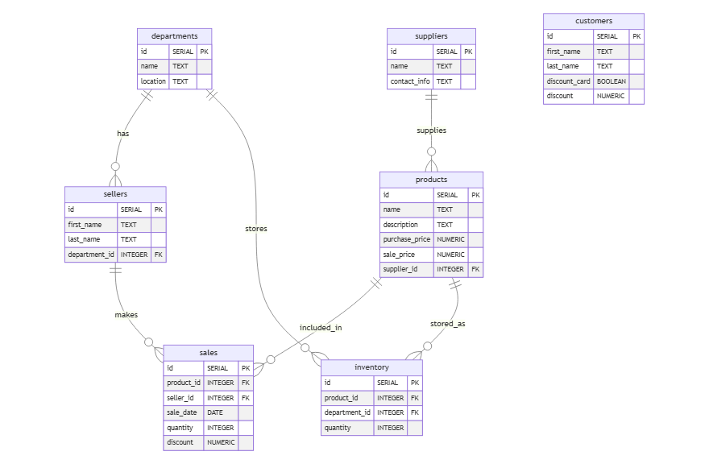

# НИЯУ МИФИ. Лабораторная работа №2-4

## Индексы

### Журбенко Василий, Б21-525  
### 2024

# Схема данных
### Таблица `departments`
- `id` (Primary Key) - уникальный идентификатор отдела
- `name` - название отдела
- `location` - локация отдела

### Таблица `products`
- `id` (Primary Key) - уникальный идентификатор товара
- `name` - название товара
- `description` - описание товара
- `purchase_price` - цена закупки
- `sale_price` - цена продажи
- `supplier_id` (Foreign Key) - идентификатор поставщика

### Таблица `suppliers`
- `id` (Primary Key) - уникальный идентификатор поставщика
- `name` - название поставщика
- `contact_info` - контактная информация

### Таблица `sales`
- `id` (Primary Key) - уникальный идентификатор продажи
- `product_id` (Foreign Key) - идентификатор товара
- `seller_id` (Foreign Key) - идентификатор продавца
- `sale_date` - дата продажи
- `quantity` - количество проданного товара
- `discount` - скидка

### Таблица `sellers`
- `id` (Primary Key) - уникальный идентификатор продавца
- `first_name` - имя продавца
- `last_name` - фамилия продавца
- `department_id` (Foreign Key) - идентификатор отдела

### Таблица `customers`
- `id` (Primary Key) - уникальный идентификатор покупателя
- `first_name` - имя покупателя
- `last_name` - фамилия покупателя
- `discount_card` - наличие дисконтной карты (да/нет)
- `discount` - скидка

### Таблица `inventory`
- `id` (Primary Key) - уникальный идентификатор записи инвентаря
- `product_id` (Foreign Key) - идентификатор товара
- `department_id` (Foreign Key) - идентификатор отдела
- `quantity` - количество товара в отделе


# Добавленные индексы
```sql
-- 1. Индекс для поиска товаров по названию
-- Частый запрос от клиентов и продавцов при поиске конкретных украшений
CREATE INDEX idx_products_name ON products USING btree (name);

-- 2. Составной индекс для анализа продаж по датам
-- Важен для отчетов по продажам, анализа выручки
CREATE INDEX idx_sales_date_product ON sales USING btree (sale_date, product_id);

-- 3. Составной индекс для проверки наличия товаров
-- Критически важен для быстрой проверки наличия товара в конкретном отделе
CREATE INDEX idx_inventory_prod_dept ON inventory USING btree (product_id, department_id);

-- 4. Индекс для анализа работы продавцов
-- Необходим для отчетов по эффективности продавцов
CREATE INDEX idx_sales_seller_date ON sales USING btree (seller_id, sale_date);

-- 5. Индекс для поиска по ценовому диапазону
-- Частый запрос при подборе украшений по бюджету клиента
CREATE INDEX idx_products_price ON products USING btree (sale_price);

-- 6. Индекс для поиска клиентов с картами лояльности
-- Важен для быстрого поиска постоянных клиентов и применения скидок
CREATE INDEX idx_customers_discount ON customers USING btree (discount_card) WHERE discount_card = true;
```

# Генерация данных
[Скрипт генерации](scripts/5_large_insert.sql)

# Результаты тестирования индексов
## Запрос выручки по дням за последние 30 дней
```sql
EXPLAIN ANALYZE
SELECT
    s.sale_date,
    SUM(s.quantity * p.sale_price * (1 - COALESCE(s.discount, 0)/100)) as revenue
FROM sales s
JOIN products p ON p.id = s.product_id
WHERE s.sale_date >= CURRENT_DATE - INTERVAL '30 days'
GROUP BY s.sale_date
ORDER BY s.sale_date;
```
<details>
<summary>QUERY PLAN</summary>

```
Sort  (cost=136.39..137.25 rows=343 width=36) (actual time=2.005..2.010 rows=31 loops=1)
  Sort Key: s.sale_date
  Sort Method: quicksort  Memory: 26kB
  ->  HashAggregate  (cost=117.66..121.95 rows=343 width=36) (actual time=1.971..1.988 rows=31 loops=1)
        Group Key: s.sale_date
        Batches: 1  Memory Usage: 45kB
        ->  Hash Join  (cost=15.96..103.00 rows=838 width=43) (actual time=0.165..0.967 rows=831 loops=1)
              Hash Cond: (s.product_id = p.id)
              ->  Bitmap Heap Scan on sales s  (cost=14.78..98.45 rows=838 width=15) (actual time=0.120..0.528 rows=831 loops=1)
                    Recheck Cond: (sale_date >= (CURRENT_DATE - '30 days'::interval))
                    Heap Blocks: exact=69
                    ->  Bitmap Index Scan on idx_sales_date_product  (cost=0.00..14.58 rows=838 width=0) (actual time=0.099..0.099 rows=831 loops=1)
                          Index Cond: (sale_date >= (CURRENT_DATE - '30 days'::interval))
              ->  Hash  (cost=1.08..1.08 rows=8 width=36) (actual time=0.027..0.028 rows=8 loops=1)
                    Buckets: 1024  Batches: 1  Memory Usage: 9kB
                    ->  Seq Scan on products p  (cost=0.00..1.08 rows=8 width=36) (actual time=0.008..0.010 rows=8 loops=1)
Planning Time: 3.354 ms
Execution Time: 2.128 ms
```
</details>

**Комментарий:** Индекс `idx_sales_date_product` работает эффективно для фильтрации по дате, что сокращает общее время выполнения запроса до 2.128 мс.

## Анализ продаж по продавцам за 90 дней
```sql
EXPLAIN ANALYZE
SELECT
    s.seller_id,
    sel.first_name,
    sel.last_name,
    COUNT(*) as sales_count,
    SUM(s.quantity * p.sale_price * (1 - COALESCE(s.discount, 0)/100)) as total_revenue
FROM sales s
JOIN sellers sel ON sel.id = s.seller_id
JOIN products p ON p.id = s.product_id
WHERE s.sale_date >= CURRENT_DATE - INTERVAL '90 days'
GROUP BY s.seller_id, sel.first_name, sel.last_name
ORDER BY total_revenue DESC;
```
<details>
<summary>QUERY PLAN</summary>

```
Sort  (cost=374.37..378.37 rows=1600 width=108) (actual time=2.958..2.963 rows=8 loops=1)
  Sort Key: (sum((((s.quantity)::numeric * p.sale_price) * ('1'::numeric - (COALESCE(s.discount, '0'::numeric) / '100'::numeric))))) DESC
  Sort Method: quicksort  Memory: 25kB
  ->  HashAggregate  (cost=269.22..289.22 rows=1600 width=108) (actual time=2.940..2.950 rows=8 loops=1)
        Group Key: s.seller_id, sel.first_name, sel.last_name
        Batches: 1  Memory Usage: 73kB
        ->  Hash Join  (cost=73.65..204.85 rows=2575 width=107) (actual time=0.151..1.372 rows=2561 loops=1)
              Hash Cond: (s.product_id = p.id)
              ->  Hash Join  (cost=72.47..193.33 rows=2575 width=79) (actual time=0.126..0.991 rows=2561 loops=1)
                    Hash Cond: (s.seller_id = sel.id)
                    ->  Bitmap Heap Scan on sales s  (cost=44.25..158.31 rows=2575 width=15) (actual time=0.092..0.450 rows=2561 loops=1)
                          Recheck Cond: (sale_date >= (CURRENT_DATE - '90 days'::interval))
                          Heap Blocks: exact=69
                          ->  Bitmap Index Scan on idx_sales_date_product  (cost=0.00..43.60 rows=2575 width=0) (actual time=0.080..0.081 rows=2561 loops=1)
                                Index Cond: (sale_date >= (CURRENT_DATE - '90 days'::interval))
                    ->  Hash  (cost=18.10..18.10 rows=810 width=68) (actual time=0.012..0.013 rows=8 loops=1)
                          Buckets: 1024  Batches: 1  Memory Usage: 9kB
                          ->  Seq Scan on sellers sel  (cost=0.00..18.10 rows=810 width=68) (actual time=0.004..0.005 rows=8 loops=1)
              ->  Hash  (cost=1.08..1.08 rows=8 width=36) (actual time=0.014..0.014 rows=8 loops=1)
                    Buckets: 1024  Batches: 1  Memory Usage: 9kB
                    ->  Seq Scan on products p  (cost=0.00..1.08 rows=8 width=36) (actual time=0.007..0.008 rows=8 loops=1)
Planning Time: 0.315 ms
Execution Time: 3.060 ms
```
</details>

**Комментарий:** Несмотря на наличие индекса `idx_sales_seller_date`, PostgreSQL использует только `idx_sales_date_product`. Это связано с оценкой оптимизатора, что сканирование по дате эффективнее для текущего объема данных.

## Поиск товаров в ценовом диапазоне
```sql
EXPLAIN ANALYZE
SELECT name, sale_price
FROM products
WHERE sale_price BETWEEN 50000 AND 100000
ORDER BY sale_price;
```
<details>
<summary>QUERY PLAN</summary>

```
Sort  (cost=48.76..49.63 rows=347 width=61) (actual time=0.737..0.751 rows=346 loops=1)
  Sort Key: sale_price
  Sort Method: quicksort  Memory: 73kB
  ->  Seq Scan on products  (cost=0.00..34.12 rows=347 width=61) (actual time=0.018..0.565 rows=346 loops=1)
        Filter: ((sale_price >= '50000'::numeric) AND (sale_price <= '100000'::numeric))
        Rows Removed by Filter: 662
Planning Time: 0.475 ms
Execution Time: 0.781 ms
```
</details>

**Комментарий:** Индекс `idx_products_price` не используется из-за значительного охвата таблицы (346 из 1008 строк). PostgreSQL предпочитает последовательное сканирование.

## Поиск клиентов с картами лояльности
```sql
EXPLAIN ANALYZE
SELECT first_name, last_name, discount
FROM customers
WHERE discount_card = true
ORDER BY discount DESC;
```
<details>
<summary>QUERY PLAN</summary>

```
Sort  (cost=4.30..4.48 rows=72 width=30) (actual time=0.089..0.095 rows=72 loops=1)
  Sort Key: discount DESC
  Sort Method: quicksort  Memory: 30kB
  ->  Seq Scan on customers  (cost=0.00..2.08 rows=72 width=30) (actual time=0.015..0.036 rows=72 loops=1)
        Filter: discount_card
        Rows Removed by Filter: 36
Planning Time: 0.306 ms
Execution Time: 0.125 ms
```
</details>

**Комментарий:** Маленький размер таблицы (108 строк) делает использование индекса нецелесообразным. PostgreSQL выбирает последовательное сканирование.

## Проверка наличия конкретного товара в отделах
```sql
EXPLAIN ANALYZE
SELECT d.name as department, i.quantity
FROM inventory i
JOIN departments d ON d.id = i.department_id
WHERE i.product_id = 500;
```
<details>
<summary>QUERY PLAN</summary>

```
Nested Loop  (cost=0.15..9.72 rows=1 width=36) (actual time=0.019..0.019 rows=0 loops=1)
  ->  Seq Scan on inventory i  (cost=0.00..1.54 rows=1 width=8) (actual time=0.018..0.018 rows=0 loops=1)
        Filter: (product_id = 500)
        Rows Removed by Filter: 43
  ->  Index Scan using departments_pkey on departments d  (cost=0.15..8.17 rows=1 width=36) (never executed)
        Index Cond: (id = i.department_id)
Planning Time: 0.339 ms
Execution Time: 0.044 ms
```
</details>

**Комментарий:** Таблица мала (43 строки), поэтому индекс `idx_inventory_prod_dept` не используется. Последовательное сканирование оказывается быстрее.

